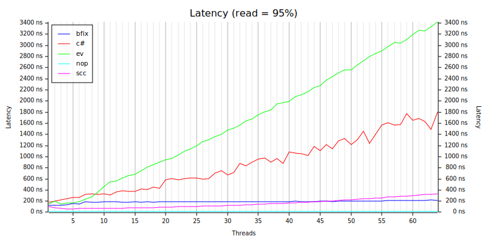
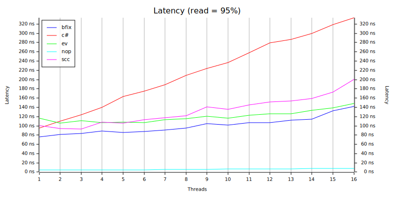

# bfix-map
An experimental hash-map used for performance research on machines with large numbers of cores and NUMA architectures. Bfix stands for fixed buckets.

This map is optimized to provide safe concurrent access for multiple threads, allowing simultaneous reads and writes without blocking the entire map.
This map has a naive implementation however it turns out to have good performance with large numbers of threads. The trade-off is that the max number of shards is set at creation time based on the provided capacity. The collection can grow to contain larger numbers of items than the specified capacity, but the number of shards does not change.

This design avoids any complex mechanisms around splitting shards.

Testing shows that on NUMA hardware minimizing memory transfers between nodes is the key. 

The test below compares performance with evmap and scc:

This chart shows results for a workload with 95% reads. The chart shows average latency. Lower is better.

- bfix = simplistic sharded lock free (this map)
- c# = ConcurrentDictionary for comparison
- ev = eventual consistency map with a reader per thread and a single writer.
- scc = shared map optimistic locking
- nop = no-operation to measure test framework overhead

The test has the following parameters:

- Initial items: 500,000 
- Operation count: 55,000,000 split over specified threads
- Operation types: 95% read, 2% insert, 1% remove, 1% modify, 1% upsert
- Hash function: ahash
- Hardware: HB120-64rs Azure VM with 64 vCPUs, 4 numa nodes, 456 GiB of RAM. The VM was running Windows.

To highlight what a difference NUMA makes, the same test performed on my 16 core i7 shows a completely different result.

The performance testing [framework is here](https://github.com/ZacWalk/map-bench)