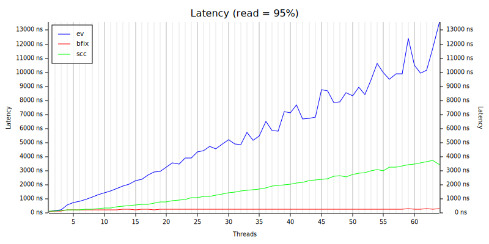

# bfix-map
An experimental hash-map used for performance research on machines with large numbers of cores and NUMA architectures. Bfix stands for fixed buckets.

With large numbers of cores any point of contention becomes magnified. BFixMap allowed me to try reducing contention as much as possible.

This map has a very naive implementation however it turns out to have very good performance with large numbers of threads. The trade-off is that the number of buckets is set at creation time based on the provided capacity. The collection can grow to contain larger numbers of items (than the specified capacity) but the number of buckets does not change. This design avoids any complex mechanisms around splitting buckets, reducing lock contention. There is only a spin lock per bucket.

Testing shows that read-write locks perform worse than a spin lock in this situation. This is true while thread activity is distributed across the buckets.

The test below compares performance with evmap and scc. It was performed on a HB120-64rs Azure VM with 64 vCPUs and 4 numa nodes. The VM was running Windows. Evmap can have much better performance under some conditions but is impacted here by multiple threads needed to access the same writer. 

