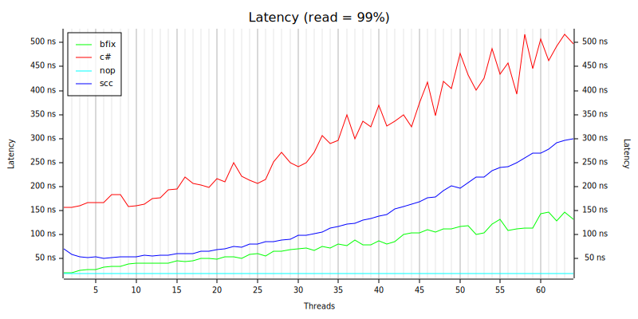
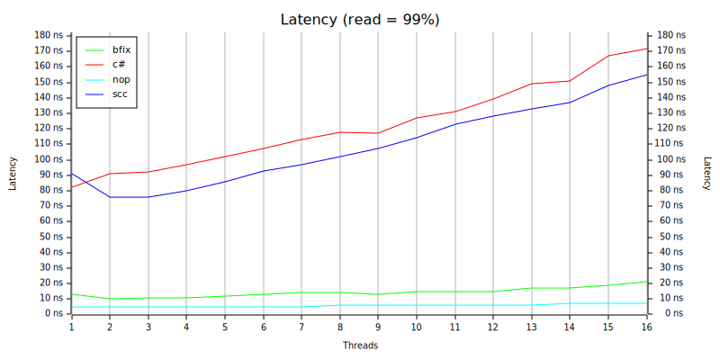

# bfix-map
An experimental hash-map used for performance research on machines with large numbers of cores and NUMA architectures. Bfix stands for fixed buckets. It is written in Rust.

This map is optimized to provide safe concurrent access for multiple threads, allowing simultaneous reads and writes without blocking the entire map.
This map uses simd probing sharding to give good performance with large numbers of threads. Currently the trade-off is that the collection capacity is set at creation. If the collection grows above that limit inserts will fail. I might implement dynamic capacity growth later if needed.

The test below compares performance with ConcurrentDictionary and scc:

This chart shows results for a workload with 95% reads. The chart shows average latency. Lower is better.

- bfix = this map - sharded simd probing hash map  
- c# = ConcurrentDictionary
- scc = shared map optimistic locking
- nop = no-operation to measure test framework overhead

The test has the following parameters:

- Initial items: 500,000 
- Operation count: 55,000,000 split over specified threads
- Operation types: 99% read, 1% upsert
- Hash function: ahash
- Hardware: HB120-64rs Azure VM with 64 vCPUs, 4 numa nodes, 456 GiB of RAM. The VM was running Windows.

To highlight what a difference NUMA makes, the same test performed on my 16 core i7 shows a completely different result.

The performance testing [framework is here](https://github.com/ZacWalk/map-bench-rust)